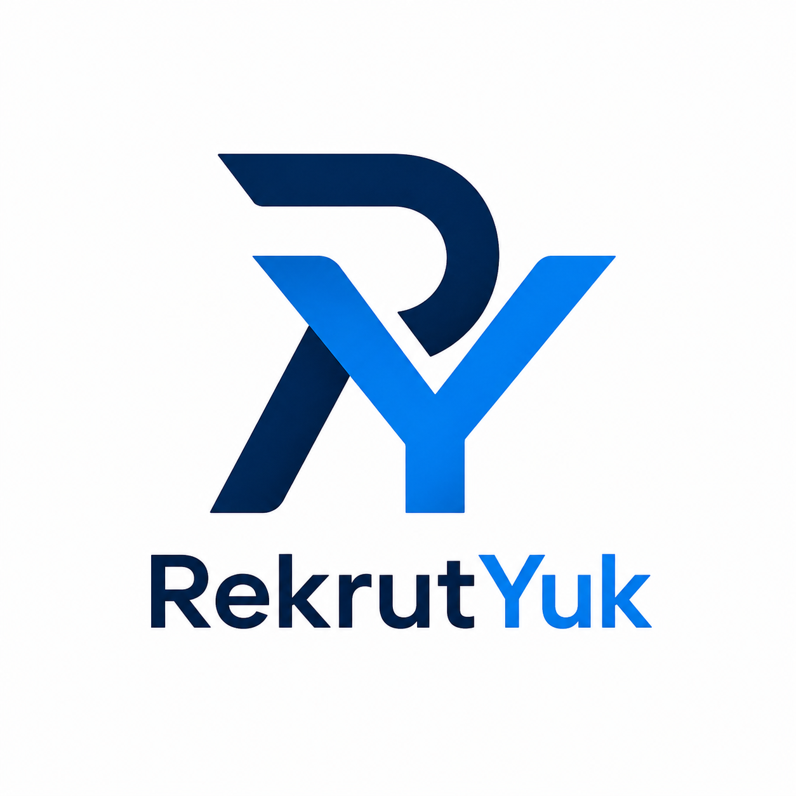

# 🤖 RekrutYuk

  

**RekrutYuk** bukan hanya aplikasi rekrutmen, tetapi sebuah framework **Agentic AI** untuk membangun sistem rekrutmen cerdas yang dapat disesuaikan dengan kebutuhan setiap perusahaan.

Dengan dukungan **Hybrid RAG**, sistem dapat mempelajari data pelamar sekaligus dokumen internal perusahaan sehingga mampu memberikan rekomendasi yang lebih akurat dan sesuai konteks.

---
### Agent Architecture

Untuk **release saat ini**, framework masih menggunakan **Single-Agent Architecture**. Artinya, seluruh proses *reasoning* dilakukan oleh **satu LLM**, sementara workflow diatur menggunakan graph dan berbagai executor (ToolNode).

Meskipun demikian, framework ini tetap mengimplementasikan prinsip-prinsip utama **Agentic AI**, yaitu agent mampu:

* 🧠 Melakukan *reasoning* terhadap permintaan pengguna.
* 🎯 Memutuskan aksi berikutnya secara mandiri.
* 🛠️ Memilih dan menjalankan tool yang paling sesuai tanpa hardcode workflow.
* 🔄 Melakukan iterasi (*reason → act → observe → reason*) hingga tujuan tercapai.
* ✅ Mengakhiri workflow secara mandiri ketika tugas telah selesai.

> **Catatan**
>
> Single-Agent **bukan berarti** non-Agentic. Banyak framework agent modern seperti LangGraph ReAct Agent, OpenAI Agents, Claude Code, Cline, dan OpenHands juga menggunakan pendekatan **single-agent** dengan workflow berbasis graph dan pemanggilan tools secara dinamis.
>
> Perbedaan utamanya adalah pada **Multi-Agent Architecture**, di mana terdapat beberapa agent yang masing-masing memiliki LLM, prompt, dan proses reasoning sendiri, kemudian saling berkolaborasi untuk menyelesaikan suatu tugas.

### ✨ Fitur Utama

- 📄 **Parsing CV Otomatis** (PDF, DOCX, TXT)
- 🎯 **Screening Kandidat** berdasarkan kebutuhan recruiter
- 💼 **Manajemen Lowongan Pekerjaan**
- 📝 **Membuat Pertanyaan Interview** secara otomatis
- ⚖️ **Membandingkan Kandidat** berdasarkan skill, pengalaman, maupun kriteria tertentu
- 💬 **AI Recruitment Assistant** untuk menjawab pertanyaan recruiter menggunakan bahasa natural
- 📚 **Hybrid RAG** yang dapat memanfaatkan:
  - Data CV pelamar
  - SOP rekrutmen
  - Panduan interview
  - Kebijakan HR
  - Knowledge base internal perusahaan
- 🤖 **Agentic AI Workflow** yang dapat diperluas dengan tools dan workflow sesuai kebutuhan perusahaan
- 🔌 **Plugin System** untuk menambahkan tool atau workflow baru dengan mudah
- 🖥️ **100% Berjalan Secara Lokal** menggunakan Ollama, tanpa bergantung pada layanan AI cloud

### 🔒 Keunggulan

- Data pelamar tetap berada di infrastruktur perusahaan
- Tidak ada biaya API AI bulanan
- Mendukung model LLM lokal yang memiliki kemampuan Tool Calling
- Seluruh workflow dapat dikustomisasi sesuai kebutuhan

  
  
  
  
  

---

## Disclaimer

This repository is an early public snapshot of the project. The production version is under active development and may differ significantly as new real-world requirements and features are continuously implemented.

---

### 🧠 The Tech Stack Inside
*   **The Brain:** [Ollama](https://ollama.com/) + **Qwen3.5:4B** (Model Kecil tapi handal, dan sangat pas untuk VRAM lokal)
*   **The Orchestrator:** **LangGraph** & **LangChain** (Arsitektur Agentic AI sejati dengan State Machine dinamis)
*   **The Knowledge:** **ChromaDB** (Vektor database untuk Unstructured RAG) & **SQLite** (Structured RAG & memori permanen)
*   **The Interface Control:** **Telegram Bot API & Local Watchdog** (Data Ingestion stage.)
*   **The Runtime:** **Python 3.11** 🐍

---

### 🌟 Arsitektur Utama: Agentic AI + RAG Dual-Core

  

Aplikasi **RekrutYuk** ini bukan sekadar aplikasi CRUD biasa atau chatbot pasif, melainkan perpaduan dua teknologi AI terdepan saat ini:

*   **Agentic AI Engine (Autonomous Reasoning):** Menggunakan graf dinamis LangGraph untuk memberikan AI "otak" dalam menentukan langkah selanjutnya. Agen bisa merencanakan strategi sendiri: kapan harus melihat daftar kandidat, kapan harus mendalami CV secara kualitatif, hingga mendeteksi *tool calling* secara otomatis.
*   **Hybrid RAG Architecture (Local Knowledge Base):** 
    *   *Unstructured RAG:* Memotong dan mengindeks berkas dokumen CV (PDF) mentah ke ChromaDB untuk pencarian semantik mendalam.
    *   *Structured RAG:* Mengekstrak data berantakan dari AI menjadi skema JSON rapi di SQLite untuk kebutuhan statistik analitik HR yang presisi.

---

### 🎯 What Makes It Awesome?

*   **Human-in-the-Loop (HITL) Guardrail:** Aksi sensitif (seperti posting lowongan atau hapus data) dikunci oleh interupsi graf. AI tidak akan mengeksekusi ke database sebelum mengirimkan notifikasi konfirmasi ke Telegram Anda. Tekan **"IYA"**, baru Agen AI bergerak!
*   **Anti-Amnesia Persistent Memory:** Ditenagai oleh `SqliteSaver`, yang membuat agen AI ini punya memori jangka panjang. Biarpun aplikasi di-restart atau komputer mati, Agen tetap ingat siapa kandidat terakhir yang sedang dibahas dan apa tugas terpendingnya.

---

## 📚 Additional Documentation

- [Getting Started](docs/getting-started.md)
- [Known Limitations & Future Improvements](docs/known-limitations.md)