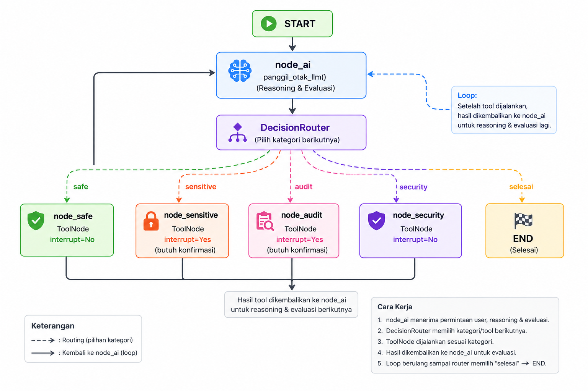

# Membuat Graph Config Baru

Graph Config digunakan untuk mendefinisikan workflow agent.

Di dalam graph inilah ditentukan:

- node apa saja yang tersedia
- tool apa yang dapat dijalankan
- bagaimana LLM memilih node
- bagaimana alur perpindahan antar node

Buat file baru di dalam folder `agentgraph_config`.

Contoh:

```text
agentgraph_config/
└── advanced_graph_config.py
```

---

# Memahami Konsep Graph

Secara sederhana workflow agent terdiri dari tiga bagian.

```
User
   │
   ▼
 node_ai
   │
DecisionRouter
   │
   ├── safe
   ├── sensitive
   ├── audit
   └── security
          │
          ▼
     Tool Executor
          │
          ▼
      kembali ke node_ai
```

Yang perlu dipahami adalah bahwa **LLM tidak langsung menjalankan Tool**.

Alur yang terjadi adalah:

1. `node_ai` menerima permintaan user.
2. `DecisionRouter` menentukan kategori yang paling sesuai.
3. Graph berpindah ke executor pada kategori tersebut.
4. Executor menjalankan Tool.
5. Hasil Tool dikembalikan lagi ke `node_ai`.

Dengan pola ini, agent dapat melakukan beberapa iterasi hingga memutuskan workflow telah selesai (`END`).

---

## Hubungan LangChain dan LangGraph

Meskipun sering digunakan bersamaan, keduanya memiliki peran yang berbeda.

### LangChain

LangChain menyediakan komponen-komponen dasar seperti:

- LLM
- Prompt
- Tool
- Memory
- Output Parser

Ibaratnya, LangChain menyediakan "bahan bangunan".

### LangGraph

LangGraph digunakan untuk mengatur bagaimana komponen-komponen tersebut saling berinteraksi.

LangGraph bertugas mengatur:

- urutan eksekusi
- percabangan (*branching*)
- looping
- state management
- workflow agent

Karena itu, hampir semua Agent modern dari LangChain sekarang dibangun menggunakan LangGraph.

---

# Mengenal ToolNode

Pada framework ini, `ToolNode` digunakan sebagai **executor** yang membungkus sekumpulan tools.

Contohnya:

```python
audit_tools = ToolRegistry.get_tools("audit")
eksekutor_audit = ToolNode(audit_tools)
```

Perlu diperhatikan bahwa `ToolNode` **bukan node graph**.

Node graph baru benar-benar dibuat ketika executor tersebut didaftarkan pada `GRAPH_CONFIG`.

```python
{
    "type": "node",
    "name": "node_audit",
    "func": eksekutor_audit
}
```

---

# Langkah Menambahkan Executor Baru

## 1. Ambil tools

Misalnya user telah membuat tools dengan

```python
@ToolRegistry.register(category="audit")
```

maka tools dapat diambil menggunakan

```python
audit_tools = ToolRegistry.get_tools("audit")
```

---

## 2. Bungkus menjadi ToolNode

```python
eksekutor_audit = ToolNode(audit_tools)
```

Executor inilah yang nantinya dipanggil oleh graph ketika kategori `audit` dipilih.

---

## 3. Beritahu DecisionRouter

Router harus mengetahui bahwa sekarang terdapat kategori baru.

```python
dynamic_router = DecisionRouter(
    tools_by_category={
        ...
        "audit": audit_tools,
    }
)
```

Jika kategori tidak didaftarkan di sini, LLM tidak akan pernah memilih kategori tersebut.

---

## 4. Daftarkan executor sebagai node

```python
{
    "type": "node",
    "name": "node_audit",
    "func": eksekutor_audit
}
```

Nama node inilah yang nanti akan digunakan pada `path_map`.

---

## 5. Tambahkan edge

Agar workflow dapat kembali ke `node_ai`, tambahkan edge.

```python
{
    "type": "edge",
    "start": "node_audit",
    "end": "node_ai"
}
```

Tanpa edge ini workflow akan berhenti pada node tersebut.

---

## 6. Tambahkan path_map

Hubungkan kategori yang dipilih router dengan node yang akan dijalankan.

```python
"path_map": {
    "audit": "node_audit"
}
```

Artinya:

- Router mengembalikan `"audit"`
- Graph berpindah ke `"node_audit"`

Perlu diingat bahwa **key** pada `path_map` harus sama dengan nama kategori yang dikenal oleh `DecisionRouter`.

---

# Safe Tool vs Sensitive Tool

Framework ini membedakan dua jenis perilaku eksekusi.

## Safe

Tool dapat langsung dijalankan tanpa meminta persetujuan user.

Contohnya:

- membaca data
- melakukan pengecekan
- query informasi

## Sensitive

Tool memerlukan konfirmasi user sebelum dieksekusi.

Hal ini dilakukan dengan memberikan:

```python
"interrupt_before": True
```

Sehingga graph akan berhenti sementara sebelum node dijalankan dan menunggu approval dari user.

Kategori lain seperti `audit` atau `security` dapat memilih perilaku masing-masing melalui properti `interrupt_before`.

Berikut adalah Contoh dari implementasi lengkapnya:
```
Python
from langgraph.graph import START, END
from langgraph.prebuilt import ToolNode # <--- PENTING: User butuh ini untuk membungkus tool barunya

# Ambil library yg dibutuhkan dari framework
from core_agent.registry import ToolRegistry
from core_agent.agent_factory import (
    panggil_otak_llm, # Yang wajib hanya ini
    eksekutor_safe, # tidak diperlukan kalau memang kamu benar2 buat baru
    eksekutor_sensitive # tidak diperlukan kalau memang kamu benar2 buat baru
)
from core_agent.agent_router import DecisionRouter

# ==========================================
# 1. Ambil Tools & buat EKSEKUTOR BARU
# ==========================================
# Asumsinya user sudah bikin tool dengan @ToolRegistry.register(category="audit") dll.
audit_tools = ToolRegistry.get_tools("audit")
security_tools = ToolRegistry.get_tools("security")

# Bungkus menjadi ToolNode (Eksekutor)
eksekutor_audit = ToolNode(audit_tools)
eksekutor_security = ToolNode(security_tools)

# ==========================================
# 2. Prepare Dynamic Routing
# ==========================================
safe_tools = ToolRegistry.get_tools("safe")
sensitive_tools = ToolRegistry.get_tools("sensitive")

# Injeksi SEMUA tools ke Router agar ia tahu rute mana yang harus dipilih
dynamic_router = DecisionRouter(
    tools_by_category={
        "safe": safe_tools,
        "sensitive": sensitive_tools,
        "audit": audit_tools,        # <--- Tambahkan kategori audit dimana ini juga bersifat sensitive
        "security": security_tools   # <--- Tambahkan kategori security dimana ini tidak bersifat sensitive
    }
)

# ==========================================
# 3. SKEMA GRAPH KUSTOM
# ==========================================
GRAPH_CONFIG = [
    # --- A. Pendaftaran Node ---
    {"type": "node", "name": "node_ai", "func": panggil_otak_llm},
    {"type": "node", "name": "node_safe", "func": eksekutor_safe},
    {
        "type": "node", 
        "name": "node_sensitive", 
        "func": eksekutor_sensitive,
        "interrupt_before": True  
    },
    
    # 🌟 DAFTARKAN NODE BARU 🌟
    {
        "type": "node", 
        "name": "node_audit", 
        "func": eksekutor_audit,
        "interrupt_before": True  # Misal: Audit selalu butuh konfirmasi manusia
    },
    {
        "type": "node", 
        "name": "node_security", 
        "func": eksekutor_security,
        "interrupt_before": False # Misal: Security bisa langsung auto-eksekusi
    },

    # --- B. Buat Jalur/Koneksi/Edge antar  Node  ---
    {"type": "edge", "start": START, "end": "node_ai"},
    {"type": "edge", "start": "node_safe", "end": "node_ai"},
    {"type": "edge", "start": "node_sensitive", "end": "node_ai"},
    
    # 🌟 END Edge UNTUK NODE BARU 🌟
    {"type": "edge", "start": "node_audit", "end": "node_ai"},
    {"type": "edge", "start": "node_security", "end": "node_ai"},

    # --- C. Pendaftaran Conditional Edge ---
    {
        "type": "conditional_edge",
        "source": "node_ai",
        "router": dynamic_router,
        "path_map": {
            "safe": "node_safe",
            "sensitive": "node_sensitive",
            
            # 🌟 MAPPING KATEGORI BARU KE NAMA NODE 🌟
            "audit": "node_audit",         # Jika router me-return "audit", pergi ke node_audit
            "security": "node_security",   # Jika router me-return "security", pergi ke node_security
            "selesai": END
        }
    }
]
```

Graph diatas akan menghasilkan alur kurang lebih seperti ini:

<p align="center">
  
</p>