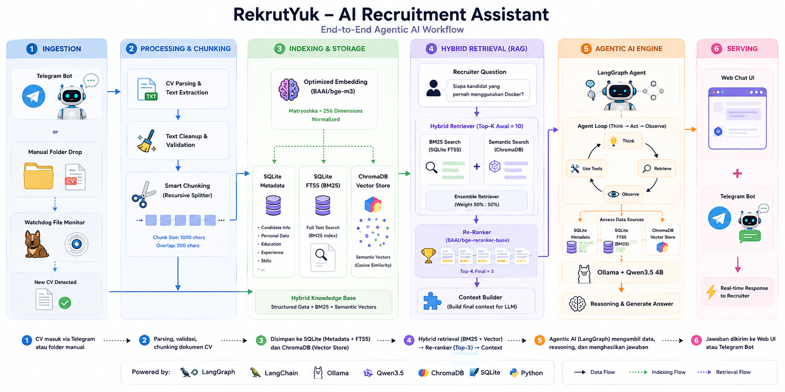

# 🚀 Getting Started
<p align="center">
  
</p>

Getting RekrutYuk up and running is straightforward.

## 1. Clone the Repository

```bash
git clone https://github.com/drr3d/rekrutyuk.git
cd rekrutyuk
```

---

## 2. Install Dependencies

Install all required Python packages:

```bash
pip install -r requirements.txt
```

### Hardware Requirements

- ✅ Windows 10/11
- ✅ Python 3.11+
- ✅ Minimum 16 GB RAM
- ✅ NVIDIA GPU (CUDA) *(optional)*
- ✅ AMD GPU (ROCm/Ollama) *(optional)*
- ✅ CPU-only mode is also supported (slower inference)

> **Note:** If you're using a GPU, make sure to install the appropriate drivers and dependencies for your hardware.

---

## 3. Install Ollama & Download a Supported Model

RekrutYuk relies on **Tool Calling** to execute its Agentic AI workflow.

> ⚠️ **Important**
>
> Not every Ollama model supports Tool Calling.
>
> Using a model without Tool Calling capability may cause the agent to fail when invoking tools, retrieving data, or executing workflows.

### ✅ Recommended Models

| Model | Recommended | Notes |
|-------|:-----------:|------|
| `qwen3.5:4b` | ⭐⭐⭐⭐⭐ | Default model. Best balance between speed and reasoning. |
| `qwen3.5:8b` | ⭐⭐⭐⭐⭐ | Better reasoning quality. Recommended if you have enough VRAM/RAM. |
| `gemma3:4b` | ⭐⭐⭐⭐☆ | Fast and lightweight. Good alternative. |
| `gemma3:12b` | ⭐⭐⭐⭐⭐ | Better accuracy for complex HR queries. |
| `qwen3:8b` | ⭐⭐⭐⭐☆ | Stable Tool Calling support. |
| `llama3.1:8b` | ⭐⭐⭐⭐☆ | Good general-purpose agent model. |

Example:

```bash
ollama pull qwen3.5:4b
```

---

The default configuration uses:

```json
{
    "model_extractor": "qwen3.5:4b",
    "model_chat_agent": "qwen3.5:4b"
}
```

You can modify these values in **config.json** to use any compatible model.

---

### 💡 Model Requirements

Your selected model should support:

- ✅ Tool Calling
- ✅ JSON Output (recommended)
- ✅ Long Context (recommended)
- ✅ Strong Instruction Following

---

## 4. Start RekrutYuk

Run the backend services:

```bash
python api_master.py
```

This starts:

- Flask API
- Watchdog (automatic CV monitoring)
- Telegram Bot

Then launch the Web Chat UI:

```bash
streamlit run app_ui.py
```

---

## 5. Customize the Agent

### Agent Tools

To add, remove, or modify tools, see:

```text
plugins/README.md
```

---

### Agent Workflow

To customize the Agentic AI workflow (LangGraph), see:

```text
core_agent/agentgraph_config/README.md
```

The default workflow is already plug-and-play, but you can freely extend it with your own tools, nodes, and routing logic.

---

## ✅ You're Ready!

Once everything is running:

1. Send a CV via **Telegram**, or
2. Drop a CV into the monitored folder.

RekrutYuk will automatically:

- 📄 Parse the CV
- ✂️ Split the document into chunks
- 🧠 Generate embeddings
- 🗄 Store metadata in SQLite
- 🔍 Index semantic vectors in ChromaDB
- 🤖 Make the candidate searchable through the Agentic AI interface